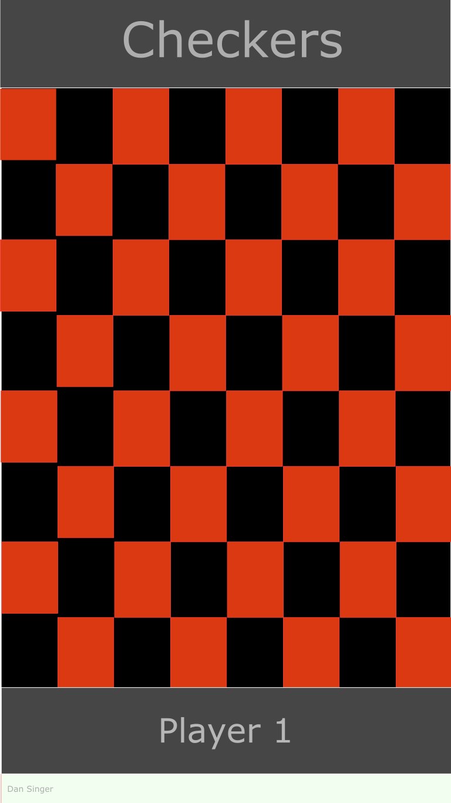

# 2P Checkers
2 player checkers game in HTML, CSS, and JavaScript.

## Mockup

## Rules
- First enter Player 1 and Player 2 names.
- 8x8 grid of squares, alternating in color
- When not a king, you can move forward left or forward right
- When a king, can also move backward left or backward right
- When able to jump, you must jump at least once, though you can pick your jump.
- When checker reaches furthest row, become king.

## Code
- Checker object
    - makeKing() 
    - playerIndex
    - isKing
- Player object
     - name
     - checkers : checker[]
     - selectChecker(checker) 
     - selectedChecker : checker
     - getAvailableMoves(checker : checker) -> checker[] 
     - movechecker(checker, targetCell)     
     - hasWon() -> boolean 
- Script scope
    - Variables
        - cells : Element[][]
        - players: Player[] 
        - activePlayer : Number
    - Functions
        - generateBoard() 
        - removechecker(cell) 
        - showMessage(msg)
        - hideBoard()
        - showBoard()
    - Event Handlers
        - board.onclick -> player.selectchecker or player.movechecker 
