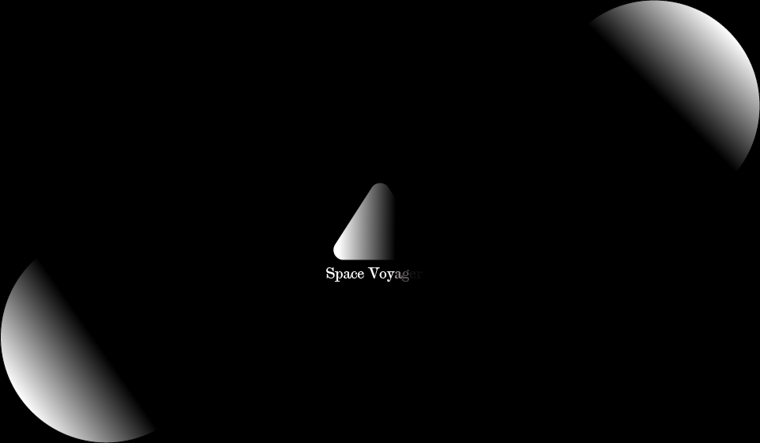
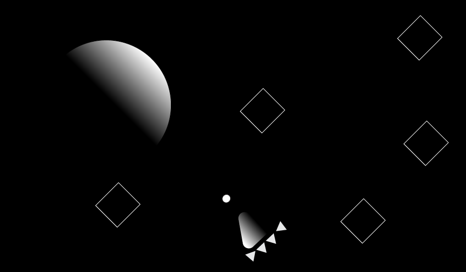

# Space Voyager

## High Concept
It's a 2D space shooter, but open-world instead of linear.

## Genre
Shooter, Exploration

## Platform
Web for desktop

## Story
**Narrative/Premise:** Evil aliens known as GL5s have been ravaging the space system.
You captain a space ship in the year 3000 and are tasked with finding and destroying each of these GL5 creatures.  

**Theme:** Good vs. Evil

**Mood:** Dark

**Player Motivation:** The player will save the space system if they can defeat each of these GL5 creatures.

## Aesthetics
- Abstract graphic style
- Sound: Electronic
    - Original main theme
    - Electronic sound effects for firing, thrust, enemy fire (3 variations), enemy death, player death, ui select

## Gameplay

### Mechanics
- The player can fight each of the GL5s in any order, with the exception of the final one, which must be fought after beating the others. 
- They can pilot their ship and fly in any direction. The camera will follow the ship everywhere, so it will be one large "room" rather 
than several smaller ones.
- There will be 4 GL5s to destroy, and each will give the player an additional unit of health.
- Health and score pickups will be availble throughout the world.

### Controls
- Keyboard controls only.
- Navigate ship: Arrows or WASD
- Fire projectile: Space
- Pause: Escape or Backspace

### Player Learning
Before the game starts, a message will be displayed stating: "Arrows/WASD = Move. Space = Fire." No other control instructions will be given, as 
the core mechanics are pretty simple.

## Other
- Music will be original and created with FL Studio.
- This game will be developed with [pixi.js](http://www.pixijs.com/)

## About the developer 
My name is Dan Singer, and I'm a second year Game Design & Development student at RIT.
My skills include game development, programming, and audio production.

